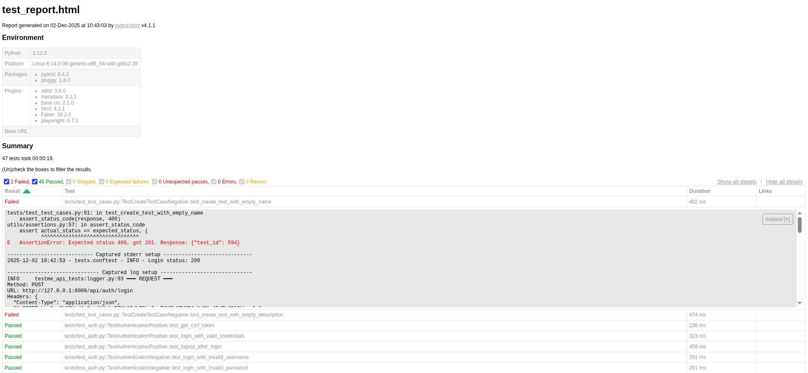

## TestMe API Test Automation

API test suite for the TestMe API using Playwright and pytest.

### Quick Start

```bash
# Install dependencies
make install

# Run tests in headless mode with console output
make test

# Run tests with HTML report
make test-html
```

## Versioning & Releases

- Current version: **0.1.0**
- See `RELEASE.md` for detailed release notes.

## Tech Stack

### Core packages

- `pytest` – testing framework
- `playwright` / `pytest-playwright` – HTTP client (`APIRequestContext`) and pytest integration
- `pytest-xdist` – parallel test execution
- `pytest-html` – HTML reports with embedded logs  
- `pydantic`, `pydantic-settings` – data models and configuration
- `faker` – test data generation
- `python-dotenv` – environment configuration
- `uv` – Python package manager

### Development tools

- `ruff` – linter and formatter (replaces flake8 + black + isort)

## Project Structure

### Core modules

- `api/`
  - `base_client.py` – low-level HTTP client using Playwright `APIRequestContext` (GET/POST/PUT/PATCH/DELETE)
  - `auth_client.py` – authentication endpoints (login, logout, CSRF token handling)
  - `test_cases_client.py` – test case CRUD and status endpoints
  - `stats_client.py` – statistics endpoints

- `models/`
  - `test_case.py` – Pydantic models for tests and statuses
  - `stats.py` – statistics response model
  - `error.py` – error response models

- `data/`
  - `factories.py` – Faker-based `TestDataFactory` for generating test data

- `config/`
  - `settings.py` – Pydantic `Settings` with env-based configuration (`.env`)

- `utils/`
  - `assertions.py` – response assertion helpers (status codes, JSON keys, partial match)
  - `logger.py` – dual logger (file logs + pytest-html logs for HTTP requests/responses)

### Tests

- `tests/test_auth.py` – authentication and CSRF token tests
- `tests/test_test_cases.py` – CRUD + status + workflow tests for test cases
- `tests/test_stats.py` – statistics aggregation tests
- `tests/test_lists.py` – listing and pagination tests
- `tests/conftest.py` – Playwright `APIRequestContext`, authenticated clients, shared fixtures

### Infrastructure

- `Makefile` – unified entrypoint for install / test / lint / docker
- `pyproject.toml` – dependencies and tool configuration
- `pytest.ini` – pytest defaults and markers
- `reports/` – HTML reports
- `logs/` – HTTP request/response logs (`log_*.log`)

## Implementation Details

### Client Pattern (API layer)

- Each logical area of the API has its own client:
  - `AuthClient` – login/logout, CSRF token extraction and storage
  - `TestCasesClient` – create/read/update/delete, status change, parsing helpers
  - `StatsClient` – retrieving statistics and parsing into `Statistics` model
- Common HTTP logic (headers, CSRF, logging) is implemented once in `BaseClient`.

### Pydantic Models

- Requests:
  - `CreateTestRequest`, `UpdateTestRequest`, `TestStatusRequest`
- Responses:
  - `CreateTestResponse`, `SetTestStatusResponse`, `TestCase`, `Statistics`, `ErrorResponse`
- Validation is done on client side before sending requests where appropriate.

### Pytest Fixtures and Workflow

- Session-level `APIRequestContext` from Playwright for all tests.
- Function-level fixtures:
  - `auth_client`, `test_cases_client`, `stats_client`
  - `authenticated_client`, `authenticated_test_client`, `authenticated_stats_client`
  - `created_test_id` – creates and cleans up a test case around a test.
- Tests are organized by markers:
  - `smoke`, `regression`, `auth`, `tests`, `stats`, `positive`, `negative`.

## Reports and Logs

### HTML Reports

- Generated by `pytest-html` via:

```bash
make test-html           # creates reports/test_report.html
```

- `reports/test_report.html` includes:
  - test execution summary and statistics
  - environment details (Python, platform, plugins)
  - per-test logs from `Logger` (REQUEST/RESPONSE blocks)

#### HTML Report Example

Generated HTML report (`reports/test_report.html`) provides a comprehensive view of test execution:



The report includes:

- overall execution summary for all TestMe API suites (auth, tests, lists, stats)
- environment details (Python version, OS, pytest and plugin versions, Faker/Playwright metadata)
- per-test status with duration and markers (smoke, regression, positive, negative, etc.)
- detailed logs for each test with timestamps and captured Playwright `APIRequestContext` calls
- HTTP request/response details (method, URL, status, headers, bodies) for TestMe endpoints
- JSON-formatted request/response bodies for API calls that return JSON
- expandable test details to quickly inspect failed or flaky API scenarios

### File Logs

- All HTTP requests/responses are logged into `logs/log_*.log` by `utils.logger.Logger`.
- Example entry:

```text
-----
Test: tests/test_auth.py::TestAuthenticationPositive::test_login_with_valid_credentials (call)
Time: 2025-12-02 10:32:29.334860
Request method: POST
Request URL: http://127.0.0.1:8000/api/auth/login
Request headers: {
  "Content-Type": "application/json",
  "Accept": "application/json",
  "Connection": "keep-alive",
  "X-CSRFToken": "ZfwMBBA1JGWiFC7bLlk52d5iRJT27Bu0bWMVmBYF5oBcG1sViZzwRFhMN8Gb3DxQ"
}
Request body: {
  "username": "alice",
  "password": "Qamania123"
}

Response code: 200
Response text:
Response headers: {
  "date": "Tue, 02 Dec 2025 08:32:29 GMT",
  "server": "WSGIServer/0.2 CPython/3.11.14",
  "content-type": "text/html; charset=utf-8",
  "content-length": "0",
  "set-cookie": "csrftoken=...; sessionid=..."
}
```

Each block contains:

- clear test identifier and phase (`setup` / `call` / `teardown`)
- precise timestamp when the HTTP interaction happened
- full request details: HTTP method, URL, headers, and serialized body
- full response details: status code, headers, and raw/JSON body
- visual separators (`-----`) between interactions for easier scanning in large logs

## Configuration

Configuration is loaded from environment variables using `pydantic-settings` (`config/settings.py`).

### `.env` example

```env
# API Configuration
API_BASE_URL=http://127.0.0.1:8000
API_TIMEOUT=30000

# Test User Credentials
TEST_USERNAME=alice
TEST_PASSWORD=Qamania123

# Test Configuration
HEADLESS=true
PARALLEL_WORKERS=4
LOG_LEVEL=INFO
```

Key options:

- **`API_BASE_URL`** – base URL for TestMe API
- **`API_TIMEOUT`** – request timeout in ms
- **`TEST_USERNAME` / `TEST_PASSWORD`** – credentials for positive auth tests
- **`HEADLESS`** – controls Playwright/headless mode
- **`PARALLEL_WORKERS`** – used for `pytest-xdist` (`-n auto`)
- **`LOG_LEVEL`** – logger level (`DEBUG`, `INFO`, etc.)

## Test Execution

```bash
make test            # run full test suite
make test-html       # run tests with HTML report
make test-smoke      # smoke subset
make test-auth       # auth tests
make test-tests      # test case management
make test-stats      # statistics
make test-lists      # list/pagination
make test-regression # regression suite
make test-positive   # positive tests only
make test-negative   # negative tests only
make test-parallel   # run tests in parallel
```

## Code Quality and Maintenance

```bash
make lint      # run Ruff checks
make fix       # auto-fix issues with Ruff
make format    # format code
make clean     # remove caches, reports and logs
make help      # list all make targets
```

## Test Coverage (High Level)

- **Authentication**
  - login/logout happy path
  - invalid credentials and edge cases
  - CSRF token retrieval and reuse
- **Test Cases**
  - create / read / update / delete
  - status changes (PASS/FAIL)
  - workflows (full CRUD + status)
  - authorization and error handling
- **Lists and Pagination**
  - list endpoints with/without pagination
  - page/size combinations and boundaries
- **Statistics**
  - structure validation
  - model parsing and consistency checks

## Available Commands

```bash
make install       # sync dependencies with uv
make test          # run test suite
make test-html     # run tests with HTML report
make lint          # run lint checks
make format        # format code
make clean         # remove caches, reports, logs
make docker-build  # build Docker image
make docker-test   # run tests inside Docker
make help          # show all commands
```

---

**API Documentation:** https://documenter.getpostman.com/view/2037649/UV5TEe6x

**TestMe App Repository:** https://github.com/Ypurek/TestMe-TCM

**Release Notes:** See [RELEASE.md](RELEASE.md) for detailed version history and changes.

